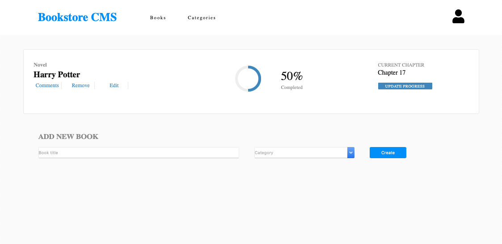

# Bookstore
> This page lets you display a list of books, add a new book and remove a selected book

# Live demo
You can see my page live [here](https://disc3110.github.io/bookstore/)

# Screenshots

## Built With
- React
- css3

## Getting Started
To get a local copy follow the following steps !
- open your terminal 
- clone this repo `git clone https://github.com/disc3110/bookstore.git`
- Install the packages with npm `npm install`
- use `npm run start` to build dist files and run local server

## Authors

👤 *Diego Solis*

- GitHub: [@disc3110](https://github.com/disc3110)

## 🤝 Contributing

Contributions, issues, and feature requests are welcome!

Feel free to check the [issues page](https://github.com/disc3110/math-magicians/issues).

## Show your support

Give a ⭐️ if you like this project!

## 📝 License

This project is [MIT](./MIT.md) licensed.
